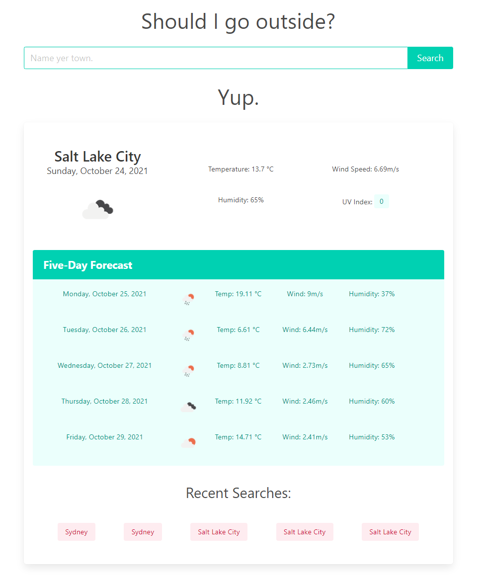

# Weather Dashboard

## Description

This website provides a weather report for any given city a user searches for and lets them know if it's comfortable outside. It is an exercise in writing JavaScript that utilizes server-side APIs -- namely <https://openweathermap.org/>.

To guide development of this project, I utilized the following User Story and Acceptance Criteria.

## User Story

```
AS A traveler
I WANT to see the weather outlook for multiple cities
SO THAT I can plan a trip accordingly
```

## Acceptance Criteria

```
GIVEN a weather dashboard with form inputs
WHEN I search for a city
THEN I am presented with current and future conditions for that city and that city is added to the search history
WHEN I view current weather conditions for that city
THEN I am presented with the city name, the date, an icon representation of weather conditions, the temperature, the humidity, the wind speed, and the UV index
WHEN I view the UV index
THEN I am presented with a color that indicates whether the conditions are favorable, moderate, or severe
WHEN I view future weather conditions for that city
THEN I am presented with a 5-day forecast that displays the date, an icon representation of weather conditions, the temperature, the wind speed, and the humidity
WHEN I click on a city in the search history
THEN I am again presented with current and future conditions for that city
```

## Built With

* HTML
* CSS
* JavaScript
* jQuery
* Bulma
* Luxon

## Website

<https://thorulfr.github.io/weather-dashboard/>

## Screenshot



## Contribution

Code by Benjamin Holt
